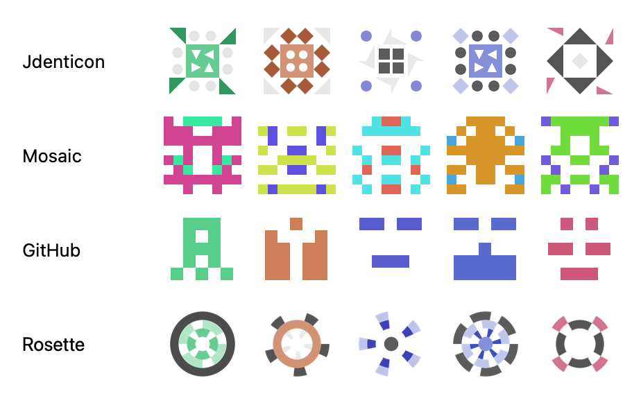
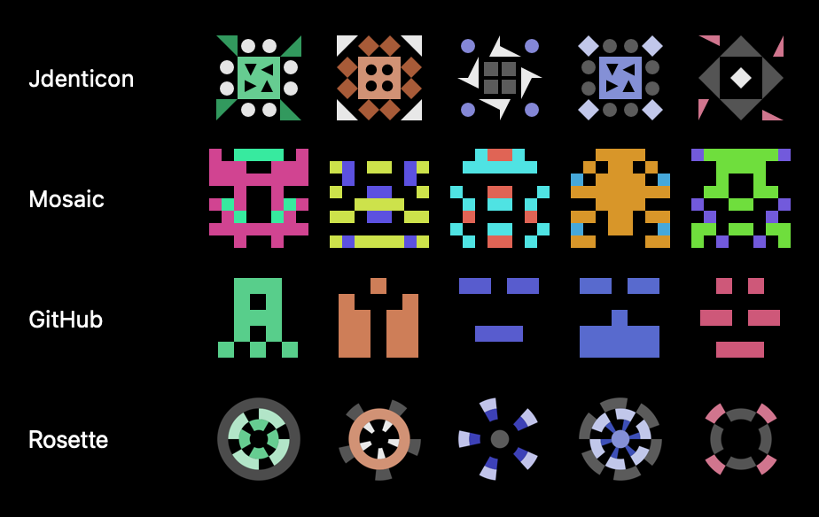

# Identikit

A small, dependency-free **identicon** generator for Apple platforms, with
**pluggable styles and renderers**. Generate a deterministic avatar from any
string (a username, an email, a public key) as an SVG string, a `CGImage`, or a
SwiftUI view.

- **Zero third-party dependencies** — only system frameworks (CryptoKit,
  CoreGraphics, SwiftUI).
- **Four built-in styles**, swappable independently of the renderer:
  - `JdenticonStyle` — organic, octagonally-symmetric vector shapes
    (a faithful port of [Jdenticon](https://github.com/dmester/jdenticon),
    byte-for-byte verified).
  - `MosaicStyle` — a symmetric, full-bleed pixel grid in two vivid colors.
  - `GitHubStyle` — the classic 5×5 mirrored single-color identicon.
  - `RosetteStyle` — a radial wheel: concentric bands of sectors with n-fold
    rotational symmetry, on Jdenticon's color theme.
- **Four built-in renderers** — SVG string, CoreGraphics (`CGImage`),
  SwiftUI `Canvas`, and the protocol seam to add your own.
- Transparent by default, so icons adapt to light or dark backgrounds.

## Preview

The four built-in styles, generated from the same seeds. Icons are transparent
by default, so they sit cleanly on light or dark backgrounds:





## Installation

Swift Package Manager:

```swift
.package(url: "https://github.com/jerimiah797/Identikit.git", from: "0.1.0")
```

Then add `"Identikit"` to your target's dependencies.

## Usage

### SwiftUI

```swift
import Identikit
import SwiftUI

IdenticonView(seed: "alice@example.com")
    .frame(width: 40, height: 40)

// Pick a style and clip it however you like:
IdenticonView(seed: userPublicKey, style: GitHubStyle())
    .frame(width: 64, height: 64)
    .clipShape(.rect(cornerRadius: 12))
```

### SVG string

```swift
let svg = Identicon.svg(for: "alice@example.com", size: 100)
// -> "<svg xmlns=...>...</svg>"

let svg2 = Identicon.svg(for: key, size: 64, style: MosaicStyle())
```

### CoreGraphics image

```swift
let image: CGImage? = Identicon.cgImage(for: "alice", size: 64, scale: 2)
```

## Styles

A **style** turns a hash into shape and color drawing calls. Choose one per
icon; the default is `JdenticonStyle`.

| Style | Look |
| --- | --- |
| `JdenticonStyle` | Multi-color octagonal vector shapes |
| `MosaicStyle(gridSize:)` | Two-color symmetric pixel grid (default 8×8) |
| `GitHubStyle(gridSize:)` | Single-color 5×5 mirrored sprite |
| `RosetteStyle(bandCount:)` | Radial wheel of banded sectors (default 3 bands) |

## Configuration

```swift
var config = IdenticonConfig()
config.backColor = IdenticonColor(red: 240, green: 240, blue: 240) // opaque tile
config.padding = 0.12
config.hues = [200, 280] // restrict to a palette

Identicon.svg(for: "alice", size: 100, config: config)
```

## Extending: custom styles and renderers

The library is built around two protocols, so styles and renderers compose
freely — any style works with any renderer.

```swift
public protocol IdenticonStyle: Sendable {
    func render(hash: String, config: IdenticonConfig, into renderer: IdenticonRenderer)
}

public protocol IdenticonRenderer: AnyObject {
    var iconSize: Double { get }
    func setBackground(_ color: IdenticonColor)
    func beginShape(_ color: IdenticonColor)
    func endShape()
    func addPolygon(_ points: [IdenticonPoint])
    func addCircle(_ corner: IdenticonPoint, diameter: Double, counterClockwise: Bool)
    func finish()
}
```

Implement `IdenticonStyle` for a new look (it only emits primitive shapes), or
`IdenticonRenderer` for a new output backend (PDF, Metal, a different vector
format…). Built-in renderers: `SVGStringRenderer`, `CoreGraphicsRenderer`,
`SwiftUICanvasRenderer`.

## License

MIT — see [LICENSE](LICENSE). `JdenticonStyle` is a port of the MIT-licensed
Jdenticon by Daniel Mester Pirttijärvi; the full notice is in the LICENSE file.
